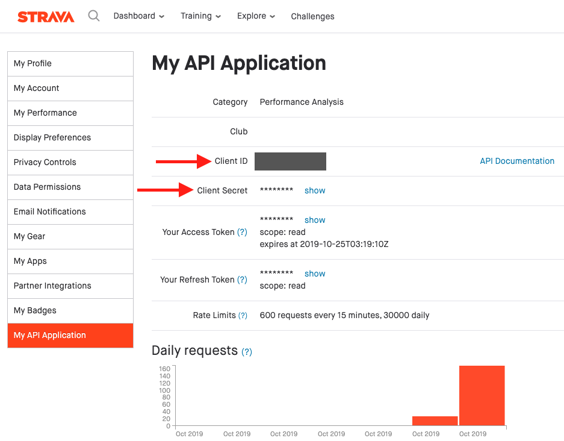
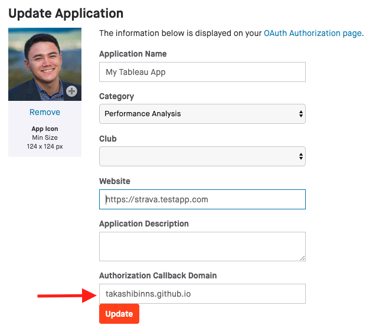
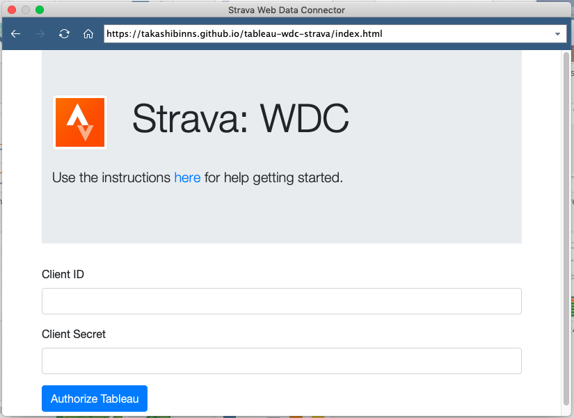
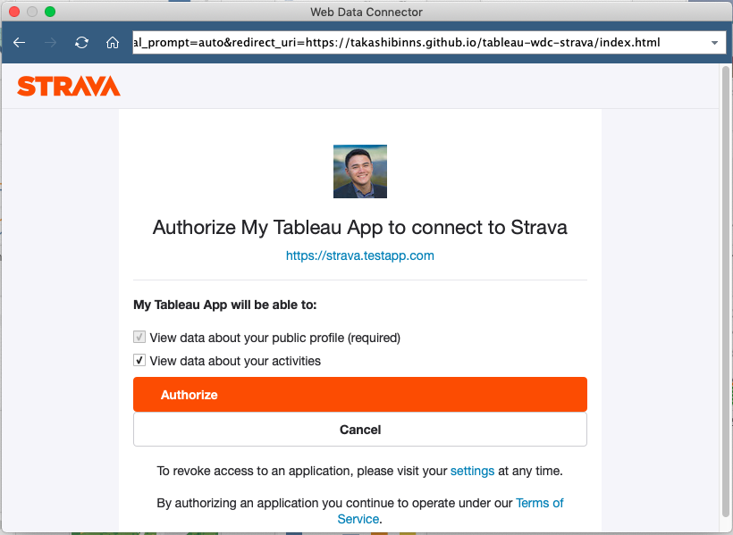
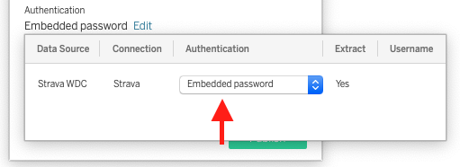

# Tableau Web Data Connector for Strava

## WDC Usage

### Step 1: Strava.com
Before you can use Strava as a data source, you need to enable a few settings through Strava's website.  Login to strava with your web browser and navigate to your [settings page](https://www.strava.com/settings/api).  Use the left navigation to find your **API Settings**.  From here, you can get your Client ID and Secret.  You'll need both these values for the WDC.



At the bottom of this page, you should see some OAuth settings.  Enter _takashibinns.github.io_ as the callback domain and click the **Update** button.



### Step 2: Tableau Desktop
From Tableau Desktop, select Web Data Connector as your data source.  Copy and paste the following link, into the popup window:

  [https://takashibinns.github.io/tableau-wdc-strava/index.html](https://takashibinns.github.io/tableau-wdc-strava/index.html)

You should see a prompt for your Strava _Client ID_ and _Client Secret_.  Enter the values, and click **Authorize Tableau**.



Now, you will have to enter your Strave email and password.  After logging in, you will get prompted to authorize Tableau to pull data from your account.  Click the **Authorize** button and you should be all set.



## Tables

 - **My Activities**: The list of the user's activities.  This contains aggregated data (avg, max, etc) for each activity.
 - **My Activity Streams**: This table contains detail-level stats for each activity.  The longer your activity lasts, the more data will appear here.  This table requires a separate API call for each activity, so if you have >500 activities in Strava you will likely hit your API limit.
 - **My Profile**: this is the logged in user's athelete information, use the AthleteId to join to Activities or Activity Streams
 - **My Gear**: The list of the user's bikes and shoes, use the GearId to join this table to Activities or Activity Streams


##  Usage with Tableau Server
To enable on Tableau Server, publish your data source to your Tableau Server as "Strava WDC".  When you publish, make sure the Authentication is set to Embedded Password.

 

Before you can schedule the extrac refreshes, run the following TSM commands on the Tableau Server:
```
tsm data-access web-data-connectors add --name 'Strava WDC' --url 'https://takashibinns.github.io:443/tableau-wdc-strava/index.html' --secondary 'https://www.strava.com/(.*),https://takashibinns.github.io/tableau-wdc-strava/(.*)'
tsm pending-changes apply
```

This will require a server restart, but once complete you should be able to schedule your refreshes.  

### Background
This step is needed, because the WDC links out to other 3rd party sites.  The WDC webpage is hosted on github (the --url parameter) and this page makes references to other files/web pages (the --secondary parameter).  This TSM command tells Tableau server that all these places are OK to be trusted.

Strava allows API access through the use of refresh and access tokens.  The access token is needed for every API call, as a security check.  However, these access tokens are only valid for 6 hours.  Once they expire, you are required to request a new access token by providing your refresh token.  When you publish your Tableau Data Source, the refresh token, access token, and expiration time are embedded in the data source.  This way Tableau Server can evaluate the access token when it goes to execute a refresh.  If the access token is expired, it will use the access token to request a new one before asking for any data.

When you publish the WDC to Tableau Server, you are embedding the client id, client secret, & refresh token so that Tableau Server can make all the API calls it needs without prompting you for permission.

### Strava Notes
Strava enforces rate limiting on their APIs.  According to their website, they limit the number of API calls to 600 requests every 15 minutes, and 30,000 per day.  If you notice your WDC is getting stuck without error, it's likely because you've hit your API limit.  This is more likely to happen with the Activity Stream table, as we have to query for each activity and then run a query for each activity to get it's data stream.  This means if you have 100 activities, we make the initial API call for the list of activities and then 100 more for the stream data of each activity.
